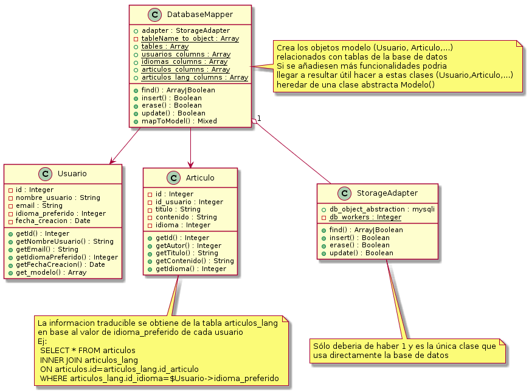
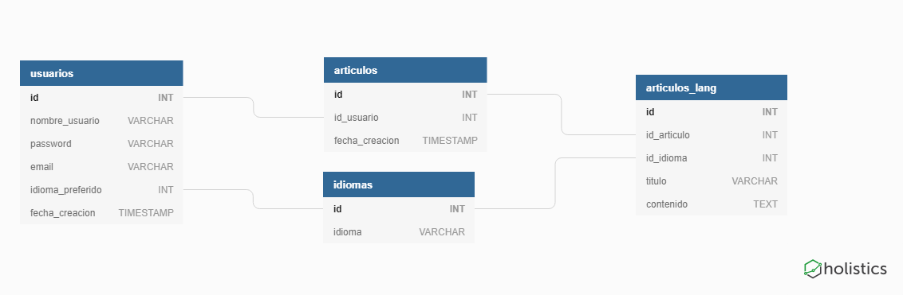

***Importante: tanto este archivo como el directorio docs se refieren al proyecto base debido a que ilustra más ampliamente los objetivos y requerimentos
de este ejercicio.

Adicionalmente este archivo lo escribí en inglés debido a que los comentarios del código los escribí en español.***

# Index
1. [How does this work and Class Diagram](#how-does-this-project-work)
2. [Multilingual Support and Database Diagram](#multilingual-support)
3. [Project's Structure](#projects-structure)
4. [Commands (Installation and Execution)](#commands)
5. [Important Notes about DatabaseMapper](#important-notes-about-databasemapper)

# How does this project work?
This project is a [DataMapper's design pattern](https://designpatternsphp.readthedocs.io/en/latest/Structural/DataMapper/README.html) implementation. It relates database's tables with object models written in PHP. In this example implementation we are creating a `db_articulos` database in which we are going to store users and articles.



# Multilingual support

Its configured to use utf8mb4 charset encoding, which enables support for all kind of characters (Asia and middle East languages' characters included).

Database's schema is algo designed to store articles translated into several languages and relate all translations to the same article reference. This is achieved by storing all translated fields within `articles_lang` table and storing untranslatable information (like author's reference or creation date) within `articles` table, as shown in the following diagram: 



# Project's structure
This project is divided in 2 sections `database` and `php`, both with its own directory.

1. **Database**
    - Within `database` directory we can see `import` and `sql` directories. `sql` directory has the needed sql files to create and delete the database and within `import` directory there is `import.sql` file which takes all csv files within `import/csv_import_files/` and imports its data to the tables that `sql/create_db.sql` has already created.
    - We can also find `sql/my.cnf` which has the needed config settings for mysql's multilingual support.
2. **PHP**
    - Within `php` directory we can find `models` and `ORM` directories ORM stands  for `Object Relational Mapping`, it basically fetches the data from database and maps it into php objects. We call `models` to the classes that define the objects instanciated by our `ORM` implementation and store them all within `models` directory.
3. **Test**
    - We also have `test` directory which uses PHPUnit framework to perform all required assertions. It uses `credentials.php` file instead of `phpunit.xml` config file to ensure we are using same credentials than our application. These credentials are being hidden from git using `.gitignore` file,the same as `vendor` directory.

# Commands
1. To create database run the following command from `database` directory: 
    ```bash
    mysql -u $USER -p < ./sql/create_db.sql
    ```
2. To delete database run the following command from `database` directory: 
    ```bash
    mysql -u $USER -p < ./sql/delete_db.sql
    ```
3. To import this project's example data to the database run the following command from `database` directory:
    ```bash
    mysql -u $USER -p < ./import/import.sql
    # Database needs to have been created already
    ```
4. To execute the php matcher run the following command from `php` directory:
    ```
    php mysqli.php
    ```
5. To execute PHPUnit tests run the following commands from project's root directory:
    ```
    composer install
    ./vendor/bin/phpunit --bootstrap vendor/autoload.php -testdox /tests/DatabaseTest
    ```
6. To query articles you can use the following sql command (replacing `$Usuario->idioma_preferido` for a valid integer id_idioma):
    ```sql
    SELECT * FROM articulos
    INNER JOIN articulos_lang
    ON articulos.id=articulos_lang.id_articulo
    WHERE articulos_lang.id_idioma=$Usuario->idioma_preferido
    ```
# Important notes about DatabaseMapper
This class isn't fully implemented (not even as a MVP). The most urgent missing features are:

   1. User input sanitizing and data types validation using [filter_var()](http://php.net/manual/en/filter.filters.php) and custom code.
   2. When a model requires data from more than one table to be built `DatabaseMapper()` doesn't know how to handle it.

Its important to notice that with this class fully implemented it would be easy to automatize the whole process of database creation/deletion and data import/export.
